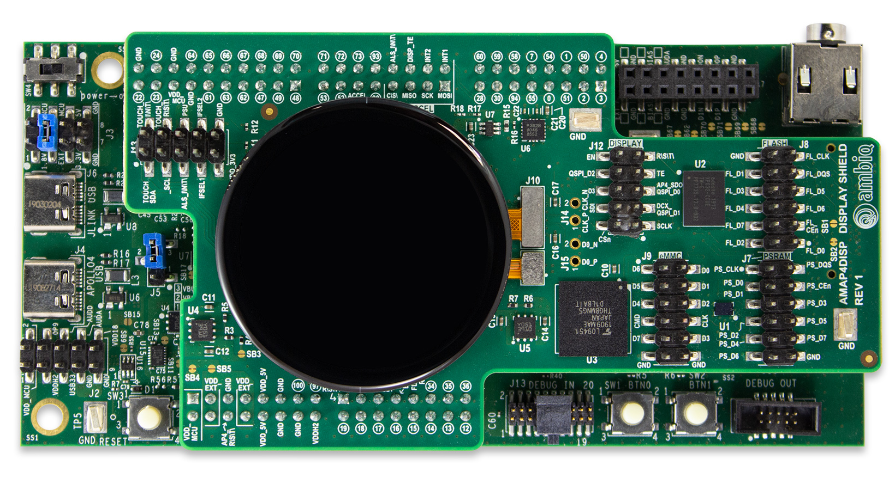

..
    Copyright 2021-2023 MicroEJ Corp. All rights reserved.
    Use of this source code is governed by a BSD-style license that can be found with this software.

.. |BOARD_NAME| replace:: AMAP4PEVB
.. |BOARD_REVISION| replace:: 1
.. |RCP| replace:: MICROEJ SDK
.. |VEE_PORT| replace:: MicroEJ VEE Port
.. |VEE_PORTS| replace:: MicroEJ VEE Ports
.. |SIM| replace:: MicroEJ Simulator
.. |ARCH| replace:: MicroEJ Architecture
.. |CIDE| replace:: MICROEJ SDK
.. |RTOS| replace:: FreeRTOS RTOS
.. |MANUFACTURER| replace:: Ambiq

.. _README MicroEJ BSP: ./AMBIQ-AMAP4PEVB-FreeRTOS-bsp/projects/microej/README.rst
.. _RELEASE NOTES: ./RELEASE_NOTES.rst
.. _CHANGELOG: ./CHANGELOG.rst

==========================================
|VEE_PORT| for |MANUFACTURER| |BOARD_NAME|
==========================================

.. image:: https://shields.microej.com/endpoint?url=https://repository.microej.com/packages/badges/sdk_5.7.json
   :alt: sdk_5.7 badge
   :align: left

.. image:: https://shields.microej.com/endpoint?url=https://repository.microej.com/packages/badges/arch_7.18.json
   :alt: arch_7.18 badge
   :align: left

.. image:: https://shields.microej.com/endpoint?url=https://repository.microej.com/packages/badges/gui_3.json
   :alt: gui_3 badge
   :align: left

This project is used to build a MicroEJ VEE Port for the |MANUFACTURER| |BOARD_NAME| development board.

Clone the repository with ``git clone --recursive https://github.com/MicroEJ/VEEPort_Ambiq-Apollo4PlusEVB.git``

Related Files
=============

This directory also contains:

* `CHANGELOG`_ to track the changes in the MicroEJ
  |BOARD_NAME| VEE Port
* `RELEASE NOTES`_ to list:

  - The list of the dependencies and their versions.
  - The known issues and the limitations,
  - The development environment.

* `README MicroEJ BSP`_ recommended for users familiar with the
  |MANUFACTURER| SDK and advanced usage on how to customize the build
  process.

Board technical specifications
==============================

.. list-table::

   * - Name
     - |BOARD_NAME|
   * - Revision
     - |BOARD_REVISION|
   * - MCU part number
     - AMAP42KP-KBR (BGA)
   * - MCU revision
     - 1
   * - MCU architecture
     - ARM Cortex M4
   * - MCU max clock frequency
     - 192 MHz
   * - Internal flash size
     - 2 MB
   * - Internal RAM size
     - 2 MB SRAM, 384 kB DTCM, 384 kB Extended Memory
   * - External flash size
     - Not Available
   * - External RAM size
     - Not Available
   * - Power supply
     - USB

You may find some flash memory onto the Hardware display shield:

- 256 Mb Hes-SPI DDR enabled PSRAM
- 64 Mb Octal-SPI DDR enabled Flash

All the |BOARD_NAME| board documentation can be found on the `Apollo4 Plus ambiq website <https://ambiq.com/apollo4-plus/>`_.

Access to these documents requires a valid |MANUFACTURER| account with Apollo4 documentation access permissions. Contact |MANUFACTURER| support to get the correct access permissions.

VEE Port Specifications
=======================

The Architecture version is ``7.18.0``.

This VEE Port provides the following Foundation Libraries:

.. list-table::
   :header-rows: 1

   * - Foundation Library
     - Version
   * - BON
     - 1.4
   * - EDC 
     - 1.3
   * - RESOURCEMANAGER
     - 1.0
   * - SNI
     - 1.4.0
   * - TRACE
     - 1.1
   * - WATCHDOG
     - 1.0

The |VEE_PORT| is derived into:

- a Mono-Sandbox VEE Port

Requirements
============

- PC with Windows 10
- IAR 8.50.6 or higher
- Segger Jlink 7.50 or higher
- Internet connection to `MicroEJ Central Repository <https://developer.microej.com/central-repository/>`_
- |RCP| Dist. ``20.12`` or higher, available `here <https://developer.microej.com/get-started/>`_
- |BOARD_NAME| board

BSP Setup
=========

IAR Embedded Workbench Setup
----------------------------

1. Install IAR Embedded Workbench version 8.50.6 for |BOARD_NAME|, available `here <https://www.iar.com/iar-embedded-workbench/>`__
2. Follow the patch instruction located `here <./AMBIQ-AMAP4PEVB-FreeRTOS-bsp/sdk/debugger_updates/README_tools_support_for_Apollo4Plus.txt>`__

Segger Jlink Setup
----------------------------

1. Install Segger Jlink for |BOARD_NAME|, available `here <https://www.segger.com/downloads/jlink/>`__

BSP Compilation
---------------

The VEE Port provides a pre-compiled Mono-Sandbox Application.
Validate the BSP installation by compiling the BSP to build a MicroEJ
Firmware.

To build the ``AMBIQ-AMAP4PEVB-FreeRTOS-bsp`` project, open a
terminal:

- Go to the directory ``xxx/AMBIQ-AMAP4PEVB-FreeRTOS-bsp/projects/microej/iar/scripts``.

Run the following commands:

**On Windows:**

.. code-block:: sh

      $ ./build.bat

The BSP project build is launched. Please wait for the end of the build.

The build script expects the toolchain to be installed at a known
path. If you installed it elsewhere, see `README MicroEJ BSP`_ to customize its path.

Board Setup
===========

Please refer to the |MANUFACTURER| documentation available `here
<https://ambiq.com/apollo4-plus/>`__
for more details.

Power Supply
------------

The board can be powered by USB cable plugged on J6.

Please refer to the |MANUFACTURER| documentation available `here
<https://ambiq.com/apollo4-plus/>`__
for more details on power supply options.

Programming
-----------

The |BOARD_NAME| board includes an on-board J-Link Debugger.
The internal memory can be programmed using IAR or Segger J-Link Software.

Logs output
-----------

MicroEJ VEE Port uses the virtual UART from the |BOARD_NAME|
USB port.  A COM port is automatically mounted when the board is
plugged to a computer using USB cable.  All board logs are available
through this COM port.

The COM port uses the following parameters:

.. list-table::
   :widths: 3 2

   * - Baudrate
     - 115200
   * - Data bits bits
     - 8
   * - Parity bits
     - None
   * - Stop bits
     - 1
   * - Flow control
     - None

When running a Testsuite, logs must be redirected to a secondary UART
port.  Please refer to `Testsuite Configuration`_ for a detailed
explanation.

Debugging
---------

|BOARD_NAME| board supports debug and image download using the on-board J-Link Debugger.

An external Cortex SWD debugger can also be plugged on the J13 DEBUG_IN connector.

Please refer to the `README MicroEJ BSP`_ section debugging for more
details.

VEE Port Setup
==============

VEE Port Import
---------------

Import the projects in |RCP| Workspace:

- ``File`` > ``Import`` > ``Existing Projects into Workspace`` >
  ``Next``,
- Point ``Select root directory`` to where the project was cloned,
- Click ``Finish``.

Inside |RCP|, the selected example is imported as several projects
prefixed by the given name:

- ``AMBIQ-AMAP4PEVB-FreeRTOS-configuration``: contains the
  VEE Port configuration description. Some modules are described in a
  specific sub-folder / with some optional configuration files
  (``.properties`` and / or ``.xml``).

- ``AMBIQ-AMAP4PEVB-FreeRTOS-bsp``: Contains a ready-to-use BSP
  software project for the |BOARD_NAME| board, including a
  |CIDE| project, an implementation of MicroEJ Core Engine (and
  extensions) port on |RTOS| and the |BOARD_NAME| board
  support package.

- ``AMBIQ-AMAP4PEVB-FreeRTOS-fp``: Contains the board description
  and images for the |SIM|. This project is updated once the VEE Port
  is built.

- ``AMAP4PEVB-VEEPort-CM4harfp_IAR83-{version}``:
  Contains the |RCP| VEE Port project which is empty by default until
  the VEE Port is built.

By default, the VEE Port is configured as a Mono-Sandbox Evaluation
VEE Port.

VEE Port Build
--------------

To build the VEE Port, please follow the steps below:

- Right-click on ``AMBIQ-AMAP4PEVB-FreeRTOS-configuration``
  project in your |RCP| workspace.
- Click on ``Build Module``

The build starts.  This step may take several minutes.  The first
time, the VEE Port build requires to download modules that are
available on the MicroEJ Central Repository.  You can see the progress
of the build steps in the MicroEJ console.

Please wait for the final message:

.. code-block::

                          BUILD SUCCESSFUL

At the end of the execution the |VEE_PORT| is fully built for the
|BOARD_NAME| board and is ready to be linked into the |CIDE|
project.

The VEE Port project should be refreshed with no error in the |RCP|
``AMAP4PEVB-VEEPort-CM4harfp_IAR83-{version}``.

Please refer to
https://docs.microej.com/en/latest/ApplicationDeveloperGuide/standaloneApplication.html
for more information on how to build a MicroEJ Standalone Application.

An evaluation license is needed for building an application. Please refer to
https://docs.microej.com/en/latest/overview/licenses.html#evaluation-license
for information on how to acquire and activate a license.

Testsuite Configuration
=======================

To run a Testsuite on the |BOARD_NAME| board please refer to the testsuite tutorial `here <https://docs.microej.com/en/latest/Tutorials/tutorialRunATestSuiteOnDevice.html>`__ 

In ``config.properties``, the property ``target.platform.dir`` must be
set to the absolute path to the VEE Port.  For example
``C:/AMAP4PEVB-VEEPort-CM4hardfp_IAR83-{version}/source``.
